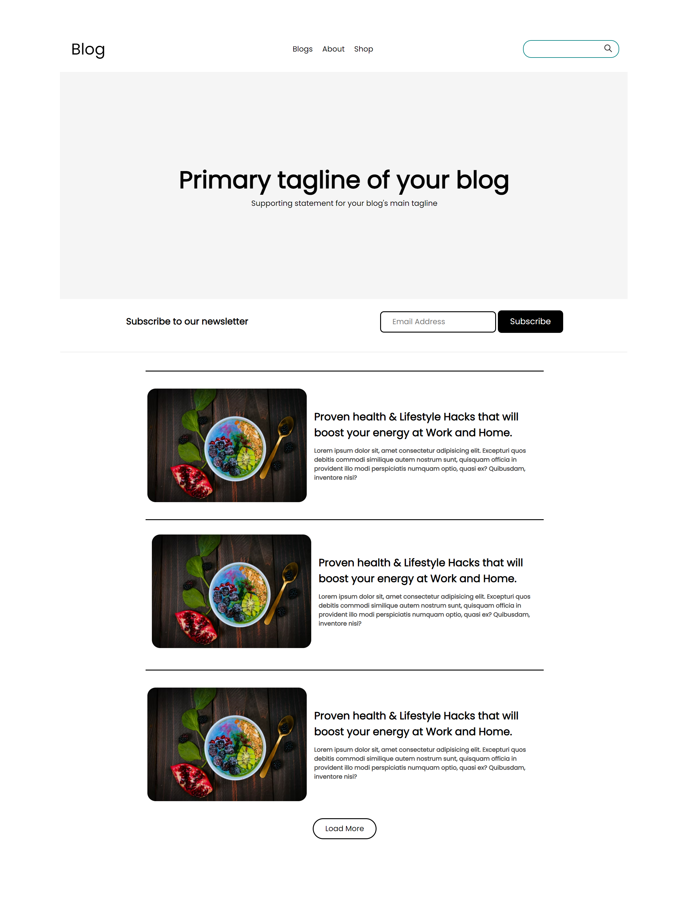
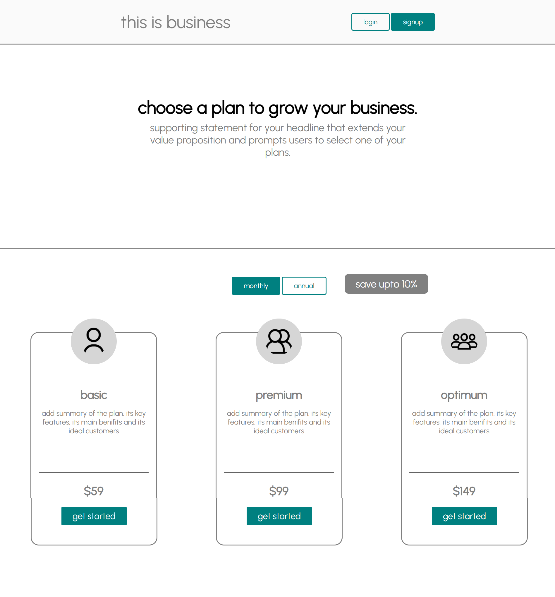
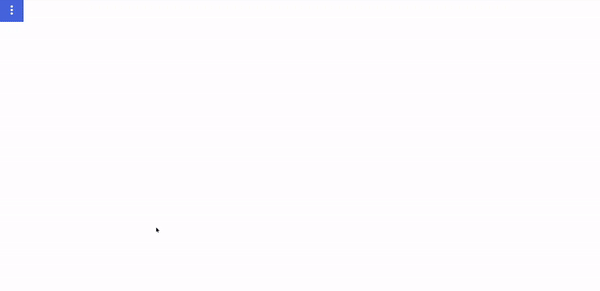
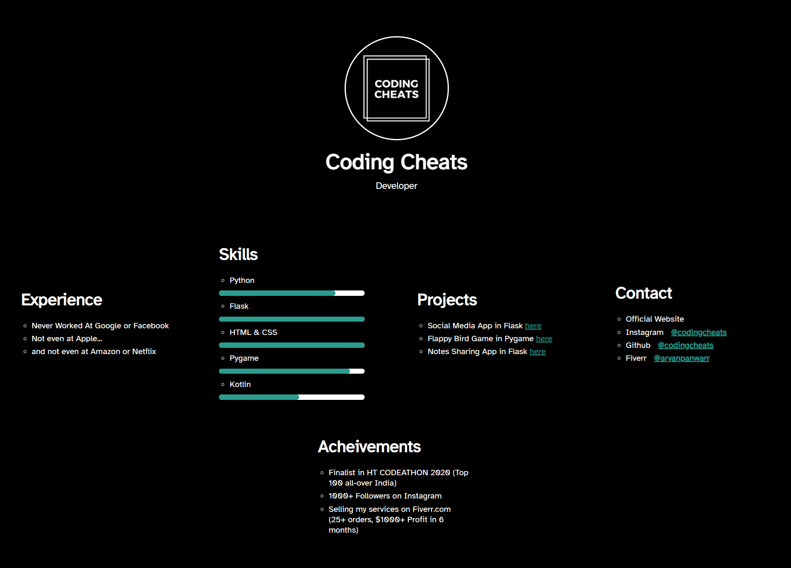

# HTML & CSS Projects📙

This project contains various HTML & CSS projects that everyone must try atleast once. This is for anyone and everyone who want to test or improve their frontend development skills. You can try these project if you are a beginner or even if you are an experienced developer. Happy Learning...
## Projects😍

- [Desktop Blog Website](https://github.com/codingcheats/html-css-project#blog-website-project-)
- [Amazing Business Website](https://www.instagram.com/codingcheats/)
- [Cool E-Commerce Website Navbar](https://www.instagram.com/codingcheats/)
- [Expandable Navbar](https://www.instagram.com/codingcheats/)
- [Minimalistic Login Page](https://www.instagram.com/codingcheats/)
- [Cool Portfolio Website](https://www.instagram.com/codingcheats/)
- [Profile Showcase Card](https://www.instagram.com/codingcheats/)
- [Cool Sidebar](https://www.instagram.com/codingcheats/)
- [Time Tracking App Design (Dark Mode)](https://www.instagram.com/codingcheats/)
- [Full Responsive Website (Travel)](https://www.instagram.com/codingcheats/)
- [Instagram Ui Design](https://www.instagram.com/codingcheats/)
- [Whatsapp Ui Design](https://www.instagram.com/codingcheats/)
## Blog Website Project ✨ 

- [Code](https://github.com/codingcheats/html-css-project/blog-website-project)
- [Demo](https://codingcheats.github.io/html-css-project/blog-website-project/index.html)

## Business Website Project ✨ 

- [Code](https://github.com/codingcheats/html-css-project/business-website-project)
- [Demo](https://codingcheats.github.io/html-css-project/business-website-project/index.html)

## E-Commerce Website Project (Navbar)✨ 

- [Code](https://github.com/codingcheats/html-css-project/ecommerce-website-project)
- [Demo](https://codingcheats.github.io/html-css-project/ecommerce-website-project/index.html)

## Expanding Navbar Project ✨ 

- [Code](https://github.com/codingcheats/html-css-project/expanding-navbar-project)
- [Demo](https://codingcheats.github.io/html-css-project/expanding-navbar-project/index.html)

## Minimalistic Login Page Project ✨ 

- [Code](https://github.com/codingcheats/html-css-project/expanding-navbar-project)
- [Demo](https://codingcheats.github.io/html-css-project/expanding-navbar-project/index.html)
## Portfolio Website Project ✨ 

- [Code](https://github.com/codingcheats/html-css-project/portfolio-website-project)
- [Demo](https://codingcheats.github.io/html-css-project/portfolio-website-project/index.html)

## Lessons Learned 📚

What did you learn while building this project? What challenges did you face and how did you overcome them?

## Feedback 📝 

If you have any feedback, please reach out to me on Instagram [@codingcheats](https://instagram.com/codingcheats/)

